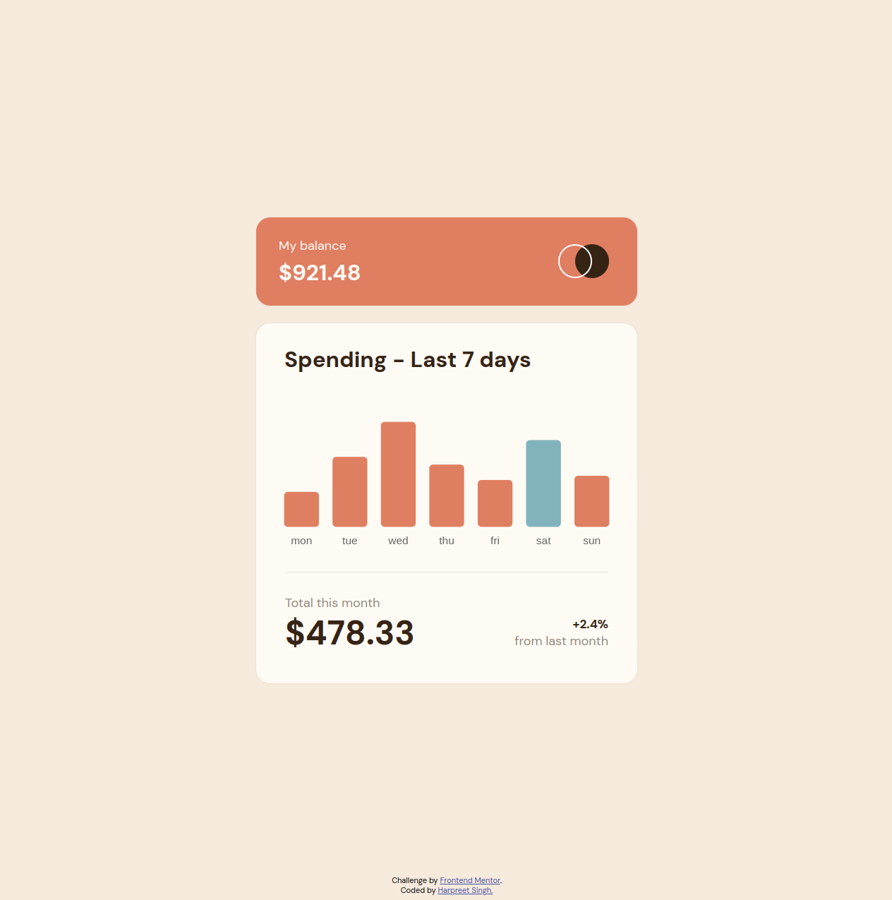
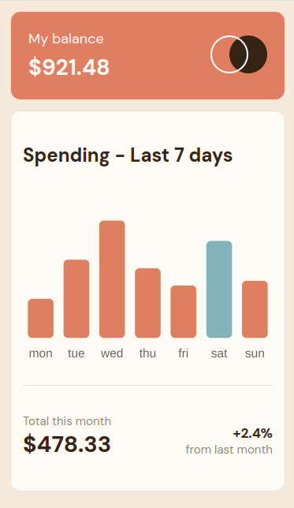

# Frontend Mentor - Expenses chart component solution

This is a solution to the [Expenses chart component challenge on Frontend Mentor](https://www.frontendmentor.io/challenges/expenses-chart-component-e7yJBUdjwt). Frontend Mentor challenges help you improve your coding skills by building realistic projects.

## Table of contents

- [Overview](#overview)
  - [The challenge](#the-challenge)
  - [Screenshot](#screenshot)
  - [Links](#links)
- [My process](#my-process)
  - [Built with](#built-with)
- [Author](#author)

## Overview

### The challenge

Users should be able to:

- View the bar chart and hover over the individual bars to see the correct amounts for each day
- See the current day’s bar highlighted in a different colour to the other bars
- View the optimal layout for the content depending on their device’s screen size
- See hover states for all interactive elements on the page
- Use the JSON data file provided to dynamically size the bars on the chart

### Screenshot

### Links

- Solution URL: [Solution URL here](https://www.frontendmentor.io/solutions/expenses-chart-component-in-react-typescript-vanilla-css-and-chartjs-Xh8fx_u4gN)
- Live Site URL: [Live site URL here](https://fe-m-expenses.netlify.app/)

## My process

### Built with

- Semantic HTML5 markup
- CSS custom properties
- Flexbox
- [React](https://reactjs.org/) - JS library
- Chart.js

## Author

- Frontend Mentor - [@harpreet-singh-147](https://www.frontendmentor.io/profile/harpreet-singh-147)
- Twitter - [@D147Harpreet](https://twitter.com/D147Harpreet)
